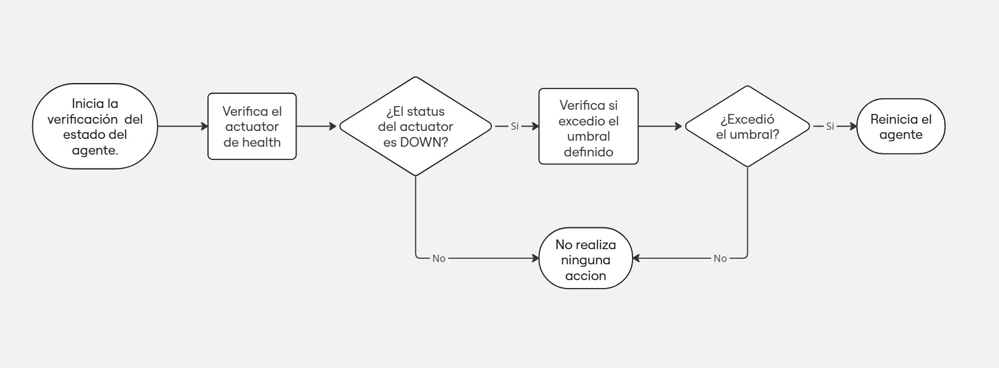
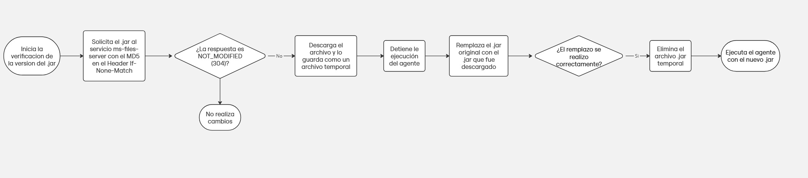

# Launcher

# Introducción

El servicio Launcher tiene como objetivo gestionar la ejecución de los archivos `.jar` de los agentes. Este servicio no solo se encarga de iniciar el `.jar` correspondiente, sino también de monitorear su estado en intervalos regulares. Si detecta que un agente no se está ejecutando correctamente, tiene la capacidad de reiniciarlo. Además, el servicio proporciona un mecanismo de autoactualización para los archivos `.jar` en caso de que existan nuevas versiones disponibles.

# Monitoreo del estado del agente



El monitoreo del estado de los agentes se realiza a intervalos regulares configurables, con el fin de verificar si el agente está funcionando correctamente. Este proceso de monitoreo implica comprobar la disponibilidad y el correcto funcionamiento del proceso que ejecuta cada `.jar`. Si el monitoreo determina que el agente ha fallado o no responde como se espera, el servicio intenta reiniciar el agente para restaurar su operación.

## Configuración

```yaml
launcher:
	url-health-check:
  downtime-threshold-health-check:
  cron-check-agent-status: 
```

- **url-health-check**: Define la URL del actuator health, que permite saber si el estado del agente es `UP` o `DOWN`. Esta propiedad trabaja en conjunto con `downtime-threshold-health-check`.
- **downtime-threshold-health-check**: Define el umbral de tiempo durante el cual, si el agente permanece en estado `DOWN`, el servicio intentará reiniciarlo.
- **cron-check-agent-status**: Define el intervalo de tiempo para realizar la verificación del estado del agente.

# Actualización de nuevas versión del .jar



Este se utiliza también para verificar si la versión del `.jar` es la última disponible. Esto es útil porque, en caso de que se desee actualizar varios agentes, el problema sería tener que ir máquina por máquina para hacer la actualización manualmente. Con el `launcher`, este proceso se automatiza, permitiendo que el `launcher` se encargue de mantener actualizados los agentes.

## Configuración

```yaml
launcher:
	cron-check-jar-file-version:
	url-jar-files-server: 
```

- **cron-check-jar-file-version**: Define la expresión cron para verificar si la versión del archivo `.jar` coincide con la versión disponible en `ms-files-server`.
- **url-jar-files-server**: Define la URL del servidor desde donde se descargará el archivo `.jar`.

# Definir parámetros para la ejecución del .jar

Mediante la configuración `launcher.params` se pueden definir los parámetros que serán enviados cuando se ejecute el comando `java -jar`. Estos parámetros permiten personalizar la ejecución del `.jar` dependiendo de las necesidades específicas del entorno. Por ejemplo, para las configuraciones que deben ser locales en cada agente, se podrían definir de esta forma:

```yaml
launcher:
	  params:
    - -Dstore=5530
    - -Did=10
    - -Dname-file-logging=.\logback-spring.xml
    - -Dserver.port=3005
    - -Dspring.application.name=pos
    - -Dspring.cloud.config.discovery.enabled=true
    - -Dspring.cloud.config.discovery.service-id=ms-config
    - -Deureka.client.serviceUrl.defaultZone=http://localhost:8761/sv-eureka/eureka/
    - -Dmanagement.security.enabled=false
    - -Deureka.instance.preferIpAddress=true
    - -Dspring.cloud.config.fail-fast=true
```