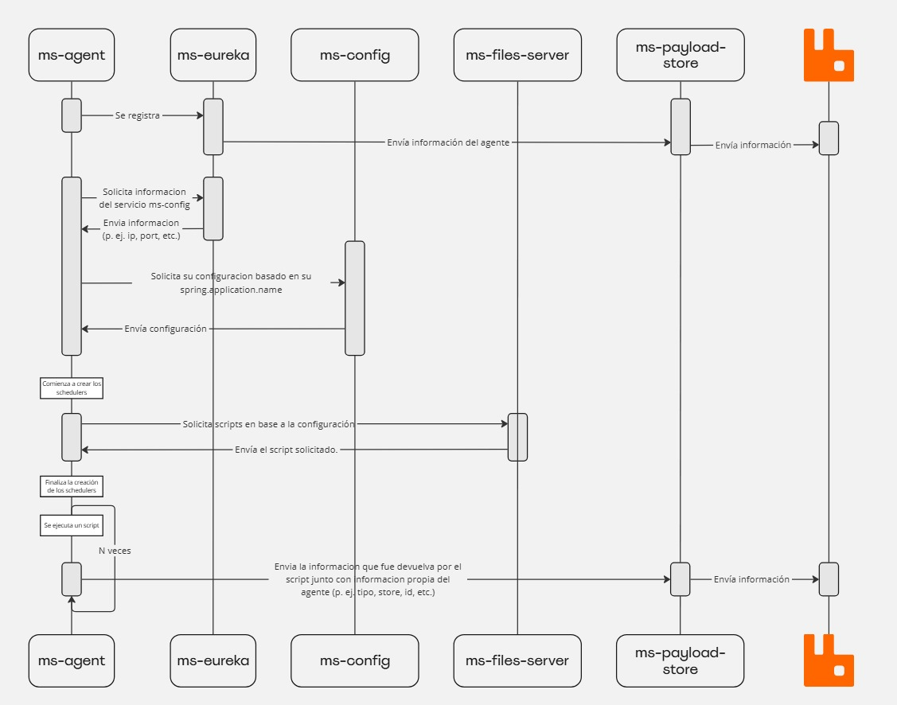
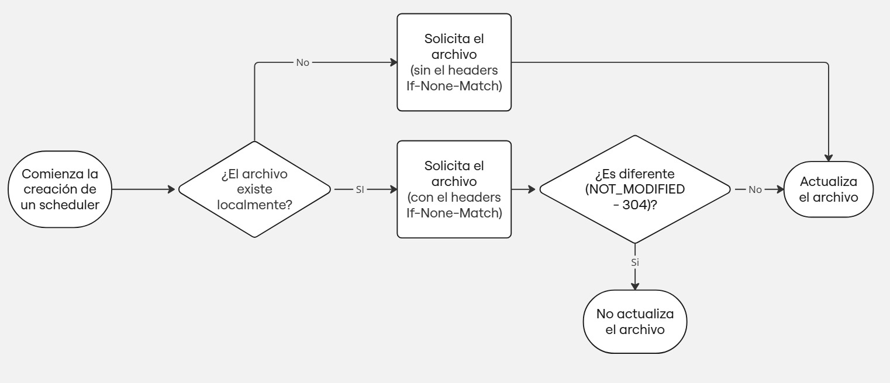

# ms-agent

# Introducción



Este microservicio es un componente esencial dentro de la arquitectura distribuida, cuyo propósito es recopilar información de los nodos en los que se ejecuta. Su diseño permite la recolección y transmisión de datos relevantes hacia un servidor central, lo cual facilita un monitoreo centralizado y eficiente de la infraestructura.

El microservicio se encarga de proporcionar una visión global del estado y rendimiento de cada nodo, permitiendo así la detección oportuna de problemas y optimizando la gestión de los recursos de toda la infraestructura.

# Configuración del HOST

El HOST que representa el ID del agente al conectarse a Eureka y enviar la información al microservicio `ms-payload-store` se configura a través de la propiedad `eureka.instance.appname`. Esta propiedad define el nombre de la aplicación que se registrará en el servidor Eureka, permitiendo identificar cada nodo de forma única.

Ejemplo de configuración en el archivo `application.yml`:

```
eureka:
  instance:
    # Esta propiedad configura el nombre de la aplicación que se registra en Eureka.
    appname: ${spring.application.name}-${id}-${store}
```

Esta configuración podría ser utilizada, por ejemplo, para un agente de tipo POS, donde `spring.application.name` sería el tipo (en este caso `pos`), `id` sería el identificador del POS, y `store` sería la tienda a la que pertenece dicho POS.

El valor de `appname` debe ser único para cada agente, de modo que el servidor central pueda diferenciar entre los distintos nodos que están enviando información. Además, esta configuración facilita la gestión y el monitoreo de los nodos a través del servidor Eureka.

El servicio `ms-agent` obtiene parte de su configuración mediante Discovery config (**ms-config**), lo cual permite adaptar su comportamiento según las configuraciones centralizadas. Sin embargo, cada nodo tiene configuraciones específicas que deben definirse localmente (variables de entorno), como el tipo de nodo, su ID, la tienda (`store`), entre otros. Estas configuraciones específicas deben estar definidas en cada nodo individual para asegurar una correcta identificación y operación dentro del sistema distribuido. Por ejemplo, todos los nodos que son tipo POS van a correr los mismos scripts, esta configuración debe estar en la configuración centralizada, pero el ID y la tienda a la que pertenece cada POS debe estar localmente en cada nodo.

## Configuración de los parámetros localmente

A continuación se presenta una tabla con las variables de configuración locales que deben establecerse en cada agente:

| Variable | Descripción | Opcional | Valor |
| --- | --- | --- | --- |
| spring.application.name | Define el tipo de agente. (p. ej. POS, STORE, CENTRAL, etc.) | No | - |
| store | Identifica la tienda a la cual pertenece el nodo. (en caso de que corresponda) | Si | - |
| id | Identifica el id del agente. (en caso de que corresponda) | Si | - |
| logging.config | Especifica la ubicación del archivo de configuración de logging para el agente. | No | - |
| name-file-logging | Define el nombre del archivo de registro para identificar los logs generados por la tienda. | Sí | - |
| server.port | Establece el puerto en el que se ejecutará el servicio. | No | - |
| spring.cloud.config.discovery.enabled | Habilita la búsqueda de configuraciones en el servidor de configuración. | No | true |
| spring.cloud.config.discovery.service-id | Especifica el nombre del servicio de configuración en Eureka desde donde se obtendrán las configuraciones centralizadas. | No | - |
| eureka.client.serviceUrl.defaultZone | Define la URL del servidor Eureka al que se conectará el agente. | No | - |
| management.security.enabled | Deshabilita la seguridad para los endpoints de administración del agente. | Sí | false |
| eureka.instance.preferIpAddres | Indica que el agente debe registrarse en Eureka utilizando la dirección IP en lugar del nombre de host. | Sí | true |
| spring.cloud.config.fail-fast | Configura el agente para fallar rápidamente si no puede conectarse al servidor de configuración. | Sí | true |

### Launcher

Para configurar estos parámetros de forma local en el agente cuando se utiliza launcher para su ejecución esto se realiza mediante el archivo de propiedades .yml del launcher en la propiedad params. Por ejemplo,

```json
  params:
    - -Dstore=5532
    - -Dlogging.config=/datadrive/SmartView/ms-agent/logback-spring.xml
    - -Dname-file-logging=STORE-5532
    - -Dserver.port=3002
    - -Dspring.application.name=store
    - -Dspring.cloud.config.discovery.enabled=true
    - -Dspring.cloud.config.discovery.service-id=ms-config
    - -Deureka.client.serviceUrl.defaultZone=http://153.78.72.134:8030/sv-eureka/eureka
    - -Dmanagement.security.enabled=false
    - -Deureka.instance.preferIpAddress=true
    - -Dspring.cloud.config.fail-fast=true
```

### Mediante **SysVInit**

Para configurar las variables localmente mediante SysVInit, es necesario enviarlas como si fueran VM Arguments.

Ejemplo:

```bash
SCRIPT="$JAVA \
  -Dstore=$STORE \
  -Dformat=\"$FORMAT\" \
  -Dserver.port=$PORT \
  -Dspring.application.name=$TYPE \
  -Dspring.cloud.config.discovery.enabled=true \
  -Dspring.cloud.config.discovery.service-id=$NAME_CONFIG \
  -Dmanagement.security.enabled=false \
  -Deureka.client.serviceUrl.defaultZone=$EUREKA \
  -Deureka.instance.preferIpAddress=true \
  -jar /home/NCRServices/SmartView/ms-agent/ms-agent.jar"
```

### Docker

Para configurar las variables mediante Docker, existen dos opciones según se use un archivo `docker-compose.yml` o el comando `docker run`.

### Usando Docker Compose

Para configurar las variables mediante Docker Compose, se deben pasar los argumentos utilizando la propiedad `environment` de la siguiente manera:

```yaml
environment:
  JAVA_OPTS: >-
    -Dstore=5532 \
    -Dlogging.config=/datadrive/SmartView/ms-agent/logback-spring.xml \
    -Dname-file-logging=STORE-5532 \
    -Dserver.port=3002 \
    -Dspring.application.name=store \
    -Dspring.cloud.config.discovery.enabled=true \
    -Dspring.cloud.config.discovery.service-id=ms-config \
    -Deureka.client.serviceUrl.defaultZone=http://153.78.72.134:8030/sv-eureka/eureka \
    -Dmanagement.security.enabled=false \
    -Deureka.instance.preferIpAddress=true \
    -Dspring.cloud.config.fail-fast=true
```

### Usando Docker Run

También se pueden pasar los argumentos mediante el comando `docker run`, utilizando la opción `-e` de la siguiente forma:

```bash
docker run -d \
  -e "JAVA_OPTS=-Dstore=5532 \
  -Dlogging.config=/datadrive/SmartView/ms-agent/logback-spring.xml \
  -Dname-file-logging=STORE-5532 \
  -Dserver.port=3002 \
  -Dspring.application.name=store \
  -Dspring.cloud.config.discovery.enabled=true \
  -Dspring.cloud.config.discovery.service-id=ms-config \
  -Deureka.client.serviceUrl.defaultZone=http://153.78.72.134:8030/sv-eureka/eureka \
  -Dmanagement.security.enabled=false \
  -Deureka.instance.preferIpAddress=true \
  -Dspring.cloud.config.fail-fast=true" \
  ghcr.io/ncrvoyix-ps-retail/psr_ms_agent:<version>
```

# Configuración de Scripts que serán ejecutados en el ms-agent

La configuración de los scripts que serán ejecutados en el `ms-agent` tiene la siguiente estructura:

- **`tasks`**
    - **`scripts`**: Contiene los scripts que serán ejecutados.
        - **`[nombre_del_script]`**: Contiene el tipo de script que será ejecutado, por ejemplo, Prices, Hardware, WebfrontEOD, etc.
            - **`name`**: El nombre del archivo que será descargado por ms-files-server.
            - **`cron`**: La frecuencia con la que será ejecutado el script (expresión cron).
            - **`dependencies`**: Contiene las dependencias necesarias para que el script pueda ejecutarse correctamente. Esto es porque algunos scripts requieren de otros scripts o archivos .jar para poder ejecutarse.
                - **`name`**: Contiene el nombre de la dependencia a descargar.
    - **`globalPath`**: Ruta donde se descargarán los scripts para ser ejecutados por el agente.

Un ejemplo podria ser:

```yaml
tasks: 
  scripts:
    Hardware:
      name: "/pos/check_Hardware.sh"
      cron: "0 */10 * * * ?"
    Prices:
      name: "/pos/check_Price.sh"
      cron: "0 */5 * * * ?"
    ServiceStatus:
      name: "/pos/check_ServiceStatus.sh"
      cron: "0 */10 * * * ?"
    Version:
      name: "/pos/check_Versions.sh"
      cron: "0 0 */1 * * ?"
    PromotionPos:
      name: "/pos/check_Dp.sh"
      cron: "0 */5 * * * ?"
    FelPos:
      name: "/pos/check_Fel.sh"
      cron: "0 */10 * * * ?"

  globalPath: "/datadrive/SmartView/scripts/" 
```

## Parámetro If-None-Match.

Al crear los *schedulers* en el inicio de la aplicación, el microservicio `ms-agente` envía una solicitud al microservicio `ms-files-server`. La solicitud sigue el siguiente flujo:



# Healthchecks

ms-agent cuenta con varios *health checks* que vienen por defecto gracias a *Spring Boot Actuator*, el cual proporciona endpoints de monitoreo y gestión que nos permiten conocer el estado de la aplicación. Estos *health checks* son esenciales para garantizar la estabilidad y confiabilidad de la aplicación, ya que permiten detectar problemas antes de que se conviertan en fallas críticas.

Para que los *health checks* estén habilitados, es necesario tener la siguiente configuración, ya sea en el servidor de configuración centralizada o localmente. Si se usa en el servidor de configuración centralizada, este podría estar en el `application.yml` o en el archivo correspondiente al agente que su nombre se basa en el tipo. Por ejemplo, si el agente es de tipo POS, podemos configurarlo en el archivo `pos.yml` y eso estará habilitado para todos los agentes de tipo POS.

```
management:
  endpoints:
    web:
      exposure:
        include: info, health
```

## Custom Health Checks

### filesServer

Este es un *custom health check* que sirve para saber si todos los archivos que se quieren descargar de `ms-files-server` pudieron ser descargados con éxito en caso de que el archivo haya sido modificado. Si el archivo no fue modificado, el estado será `UP` para ese script. El estado del *health check* general será `DOWN` si al menos uno de los scripts reporta un estado `DOWN`, y será `UP` si todos los scripts reportan un estado `UP`.

```json
"filesServer": {
    "status": "DOWN",
    "details": {
        "check_Price.sh": {
            "status": "UP",
            "lastExecution": "2024-10-16T18:31:55.069552146"
        },
        "check_Versions.sh": {
            "status": "UP",
            "lastExecution": "2024-10-16T18:31:55.084863391"
        },
        "check_ServiceStatus.sh": {
            "status": "UP",
            "lastExecution": "2024-10-16T18:31:55.075945749"
        },
        "check_DpS.sh": {
            "message": "The file /store/check_DpS.sh doesn't exist in the services http://ms-files-server/sv-files-server",
            "status": "DOWN",
            "lastExecution": "2024-10-16T18:31:55.104805511"
        },
        "check_Asls.sh": {
            "status": "UP",
            "lastExecution": "2024-10-16T18:31:55.120533363"
        },
        "check_TrxLifeCycle.sh": {
            "status": "UP",
            "lastExecution": "2024-10-16T18:31:55.053775393"
        },
        "check_Hardware.sh": {
            "status": "UP",
            "lastExecution": "2024-10-16T18:31:55.114826672"
        },
        "check_WebfrontEOD.sh": {
            "status": "UP",
            "lastExecution": "2024-10-16T18:31:55.089084059"
        }
    }
}
```

### payloadStore

Este *custom health check* se usa para saber si el estado de las peticiones con el envío de la información de los scripts hacia el servicio `ms-payload-store` fueron exitosas o no.

Para `payloadStore`, existe una configuración llamada `healthCheckTimeout` que se define de la siguiente manera:

```yaml
services:
  healthCheckTimeout: 30m
```

Esto significa que el health check solo se considerara como `DOWN` si han pasado más de 30 minutos desde la última vez que una petición devolvió el estado `UP` o desde que la aplicación se levantó.

El health check  tiene la siguiente forma:

```json
"payloadStore": {
   "status":"UP",
   "details":{
      "lastExecutionUP":{
         "time":"2024-10-16T18:40:00.451913003",
         "status":"UP"
      },
      "http://ms-payload-store/sv-payload-store/api/v1/script/Prices":{
         "status":"UP",
         "lastExecution":"2024-10-16T18:40:00.380929573"
      },
      "http://ms-payload-store/sv-payload-store/api/v1/script/Asls":{
         "status":"UP",
         "lastExecution":"2024-10-16T18:40:00.227422731"
      },
      "http://ms-payload-store/sv-payload-store/api/v1/script/WebfrontEOD":{
         "status":"UP",
         "lastExecution":"2024-10-16T18:40:00.348703861"
      },
      "http://ms-payload-store/sv-payload-store/api/v1/script/Transaction":{
         "status":"UP",
         "lastExecution":"2024-10-16T18:40:00.451913003"
      },
      "http://ms-payload-store/sv-payload-store/api/v1/script/ServiceStatus":{
         "status":"UP",
         "lastExecution":"2024-10-16T18:40:00.39075333"
      }
   }
}
```

### tasks

Este health check está diseñado para asegurar que todas las tareas se ejecuten correctamente y en los tiempos estipulados.

El health check **tasks** estará en estado **UP** solo si todas las tareas requeridas se completan con éxito.

- **Criterios del Health Check "tasks"**
    
    El estado del health check **tasks** depende de la ejecución exitosa de un conjunto de tareas específicas. Los criterios para considerar que el health check está **UP** son los siguientes:
    
    1. **Descarga de Scripts desde `ms-files-server`**:
        - Todos los scripts necesarios deben descargarse exitosamente desde el microservicio `ms-files-server`. Esto asegura que `ms-agent` tenga acceso a todos los scripts que necesita para ejecutar las tareas correctamente.
    2. **Ejecución Correcta de los Scripts**:
        - Los scripts descargados deben ejecutarse sin errores. La ejecución correcta implica que los scripts no generan excepciones o errores críticos durante su ejecución.
    3. **Cumplimiento del Tiempo Máximo de Espera**:
        - Cada script tiene un tiempo máximo de espera para completar su ejecución. El health check considerará la tarea fallida si cualquier script excede este tiempo máximo, lo cual impacta el estado de **tasks**.
    4. **Envío Correcto al Servicio `ms-payload-store`**:
        - Los resultados generados por los scripts deben ser enviados al microservicio `ms-payload-store` exitosamente. Si no se logra enviar la información o se detectan errores durante el envío, el health check **tasks** estará en estado **DOWN**.
- **Configuración de Health Check Timeout**
    
    El servicio cuenta con una configuración denominada `healthCheckTimeout`, que se define en el archivo de configuración de la siguiente manera:
    
    ```
    tasks:
      healthCheckTimeout: 30m
    ```
    
    Esta configuración establece que el health check **tasks** deberá considerarse en estado **DOWN** si han pasado más de 30 minutos desde la última vez que una tarea se ejecutó con éxito, es decir, con estado **UP**, o si han pasado 30 minutos desde que la aplicación se levantó sin que se haya ejecutado ninguna tarea con éxito.
    
- **Ejemplo del health check**
    
    ```json
    "tasks":{
       "status":"DOWN",
       "details":{
          "lastExecutionTaskWell":{
             "time":"2024-10-16T18:40:00.441624139",
             "status":"UP"
          },
          "Prices":{
             "message":"Couldn't send the data of the script /store/check_Price.sh to Payload Store",
             "status":"DOWN",
             "lastExecution":"2024-10-16T18:40:00.380982774"
          },
          "Transaction":{
             "message":"Couldn't send the data of the script /store/check_TrxLifeCycle.sh to Payload Store",
             "status":"DOWN",
             "lastExecution":"2024-10-16T18:40:00.451964304"
          },
          "WebfrontEOD":{
             "message":"Couldn't send the data of the script /store/check_WebfrontEOD.sh to Payload Store",
             "status":"DOWN",
             "lastExecution":"2024-10-16T18:40:00.348757762"
          },
          "ServiceStatus":{
             "message":"Couldn't send the data of the script /store/check_ServiceStatus.sh to Payload Store",
             "status":"DOWN",
             "lastExecution":"2024-10-16T18:40:00.39080013"
          },
          "Asls":{
             "message":"Couldn't send the data of the script /store/check_Asls.sh to Payload Store",
             "status":"DOWN",
             "lastExecution":"2024-10-16T18:40:00.227491032"
          },
          "PromotionStores":{
             "message":"Cannot run program \\"/datadrive/SmartView/scripts/store/check_DpS.sh\\": error=2, No such file or directory",
             "status":"DOWN",
             "lastExecution":"2024-10-16T18:40:00.19026574"
          }
       }
    }
    ```
    

# Configuración de los servicios

El servicio **ms-agent** se encarga de la gestión y ejecución de scripts en el sistema. Para completar sus tareas, interactúa con dos servicios específicos:

Para estas interacciones, la configuración de estos servicios tiene la siguiente forma:

```yaml
services:
  payload-store:
    host: http://ms-payload-store/sv-payload-store
    save-script-url-path: ${services.payload-store.host}/api/v1/script
    healthCheckTimeout: 30m
  files-server:
    host: http://ms-files-server/sv-files-server
    get-file-url-path: ${services.files-server.host}/files
```

### Explicación de los Campos

1. **`services`**: Define los servicios externos con los cuales **ms-agent** necesita interactuar. En este caso, se configuran los servicios **payload-store** y **files-server**.
2. **`payloadStore`**: Configuración para el servicio **ms-payload-store**.
    - **`host`**: Define la URL base para acceder al servicio, que en este caso es `http://ms-payload-store/sv-payload-store`. Esto representa la dirección del servidor que maneja el almacenamiento de la información de los scripts.
    - **`save-script-url-path`**: Define la ruta específica que se usará para guardar la información de un script ejecutado. Se construye dinámicamente usando el valor del `host` y añadiendo el endpoint `/api/v1/script`. De esta forma, si la URL base cambia, se puede actualizar automáticamente en todas las rutas que dependen de ella.
    - **`healthCheckTimeout`**: Especifica el tiempo máximo de espera para los chequeos de salud del servicio, en este caso `30m` (30 minutos). Esto asegura que se pueda monitorear la disponibilidad del servicio **payloadStore**.
3. **`files-server`**: Configuración para el servicio **ms-files-server**.
    - **`host`**: Define la URL base para el servidor de archivos, `http://ms-files-server/sv-files-server`. Este es el servidor donde se almacenan los scripts que **ms-agent** debe ejecutar.
    - **`get-file-url-path`**: Especifica la ruta para obtener un archivo desde **ms-files-server**. Se construye usando el `host` y la ruta `/files`. Esta configuración permite que **ms-agent** obtenga los scripts de forma dinámica y eficiente.

### Propósito de la Configuración

Esta configuración centraliza las direcciones y rutas necesarias para interactuar con los servicios relacionados:

- **`ms-payload-store`**: Permite almacenar de forma organizada la información sobre los scripts ejecutados, lo cual es útil para llevar un registro de las ejecuciones y sus resultados.
- **`ms-files-server`**: Facilita la obtención de los scripts que deben ejecutarse. Al definir una URL específica para obtener los archivos, **ms-agent** puede garantizar que siempre tenga acceso a la versión más reciente del script requerido.

La forma en la que se construyen las URLs usando las referencias de los hosts (`${services.payloadStore.host}` y `${services.files-server.host}`) facilita la flexibilidad y el mantenimiento del código, ya que cualquier cambio en el `host` solo se debe realizar en un lugar, lo cual reduce el riesgo de errores y simplifica la administración de las configuraciones.