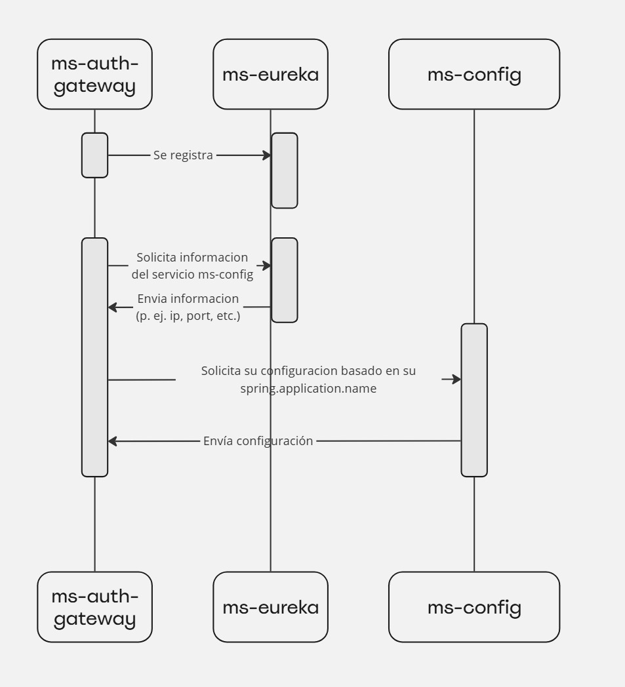
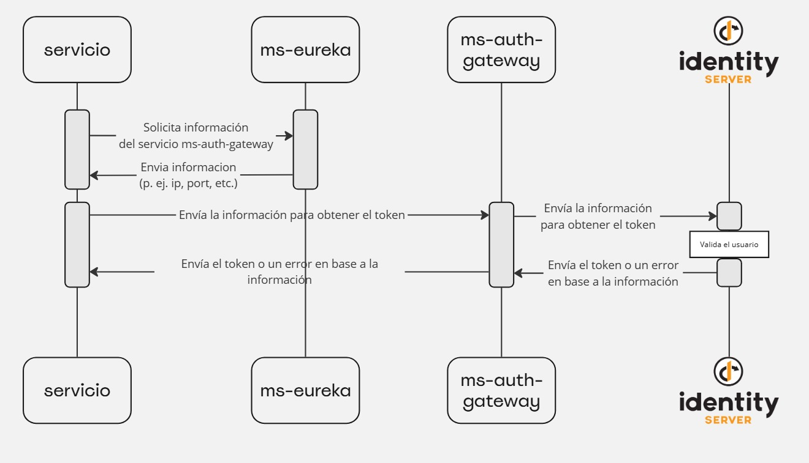

# ms-auth-gateway

# Introducción



El servicio **ms-auth-gateway** es un componente  dentro del sistema **Smart view**, el cual actúa como un gateway de autenticación para conectarse con una aplicación externa  llamada **IdentityServer**. Este servicio permite la autenticación y autorización segura para validar credenciales y obtener los tokens de acceso requeridos.

El objetivo principal de **ms-auth-gateway** es actuar como un intermediario confiable que proporciona un punto de acceso único para gestionar las solicitudes de autenticación de los usuarios que necesitan acceder a recursos protegidos fuera de **Smart view**.

# API del Servicio

El servicio **ms-auth-gateway** provee una API para que el resto de los servicios puedan obtener un token de autenticación o también acceder a las claves públicas (**JWKS**) necesarias para validar los tokens. Esta API facilita la integración con otros servicios del sistema, proporcionando de manera centralizada los recursos de autenticación requeridos.

El flujo que siguen los servicios para **obtener un token** es el siguiente:



El flujo que siguen los servicios para obtener los **JWKS es el siguiente:**


# Encriptación

El servicio **ms-auth-gateway** provee una API para encriptar texto plano utilizando un archivo **.jks** y el algoritmo **AES** (Advanced Encryption Standard). AES es un método de encriptación bidireccional, lo que significa que el texto encriptado puede ser descifrado con la clave correcta. La API está diseñada para proteger información sensible, especialmente contraseñas que pueden ser visibles en configuraciones de otros servicios.

## Detalles de la API

La API para realizar la encriptación está disponible en la siguiente ruta:

```
curl --location '/api/v1/encrypter/encrypt' \
--header 'Content-Type: application/json' \
--data '{
    "password": "",
    "textPlain": ""
}'
```

## Parámetros de la solicitud

- **password**: La contraseña del archivo **.jks**. Este archivo contiene las claves necesarias para realizar la encriptación y, por motivos de seguridad, está protegido con una contraseña que debe proporcionarse en cada solicitud.
- **textPlain**: El texto plano que se desea encriptar.

Es obligatorio enviar el parámetro **password** ya que el **.jks** está protegido, y no es posible encriptar cualquier texto sin que la persona que solicite el recurso tenga acceso a la contraseña. Esto evita la posibilidad de que alguien utilice la API como puerta trasera para encriptar información sin la autorización adecuada, manteniendo la seguridad de los datos.

## Propósito de la encriptación

La encriptación ofrecida por el servicio **ms-auth-gateway** es utilizada principalmente para proteger el **client_secret** de ciertos usuarios en otros servicios. El **client_secret** es una configuración que puede ser visible para cualquier persona con acceso a los archivos de configuración. Al utilizar este mecanismo de encriptación, se asegura que esta información crítica no sea expuesta de manera insegura, protegiendo la integridad y privacidad de los usuarios del sistema.

# Métodos de autenticación

## Client resource owner password

El servicio `ms-auth-gateway` provee la API `/api/v1/user/sign-in` para el método de autenticación **Client Resource Owner Password**. Este método es parte de IdentityServer y permite que el propietario de un recurso (el usuario) proporcione sus credenciales directamente a la aplicación cliente para obtener un token de acceso.

### Descripción de los escenarios de uso

Para este método de autenticación existen dos escenarios:

1. **Enviar solo `username` y `password`**: En este escenario, el usuario ya está registrado en la aplicación y el cliente está configurado en `ms-auth-gateway`. Los valores para `client_id` y `client_secret` se toman automáticamente de la configuración del archivo `application.yml`:
    
    ```
    auth-gateway:
      client-resource-owner-password:
        client-id: AuthGateway
        client-secret: "/8DcUuz9Fc7k1TXfyFDnWg=="
        scope: SmartView
    ```
    
    En este caso, el usuario no necesita proporcionar explícitamente el `client_id` ni el `client_secret`, ya que estos valores ya están definidos en la configuración del servicio.
    
    La solicitud tiene la siguiente forma:
    
    ```bash
    curl --location '/api/v1/user/sign-in' \
    --header 'Content-Type: application/json' \
    --data '{
        "username": "username",
        "password": "password"
    }'
    ```
    
2. **Enviar toda la información** (`username`, `password`, `client_id`, `client_secret`, `scope`): En este escenario, tanto el usuario de la aplicación como el cliente se deben especificar en la solicitud. Es importante tener en cuenta que el valor de `client_secret` debe estar cifrado si la configuración de encriptación está habilitada. Esta opción permite mayor flexibilidad, ya que se pueden especificar diferentes clientes y credenciales en la solicitud.
La solicitud tiene la siguiente forma:
    
    ```bash
    curl --location '/api/v1/user/sign-in' \
    --header 'Content-Type: application/json' \
    --data '{
        "username": "username",
        "password": "password",
        "client_id": "client_id",
        "client_secret": "client_secret",
        "scope": "scope"
    }'
    ```
    

## Client Credentials

El método de autenticación **Client Credentials** permite que una aplicación cliente obtenga un token de acceso sin la intervención de un usuario. Esto es ideal para la comunicación entre servicios cuando no se requiere la autenticación de un usuario final. El servicio `ms-auth-gateway` proporciona una API para este método de autenticación, en la cual se deben especificar `client_id` y `client_secret` en la solicitud para obtener el token. La API para este método es la siguiente:

**Nota**: El valor de `client_secret` debe venir siempre encriptado.

```bash
curl --location '/api/v1/client/sign-in' \
--header 'Content-Type: application/json' \
--data '{
    "client_id": "client_id",
    "client_secret": "client_secret_encrypted",
    "scope": "scope"
}'
```