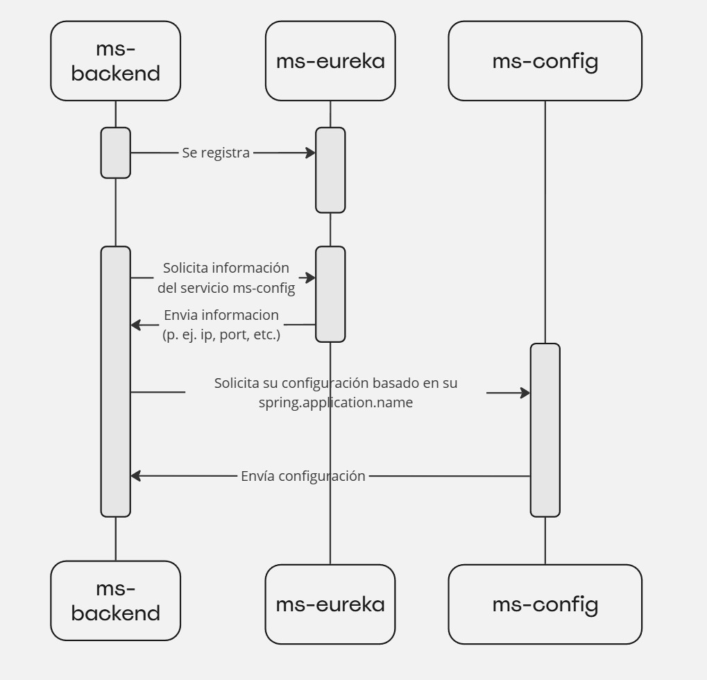
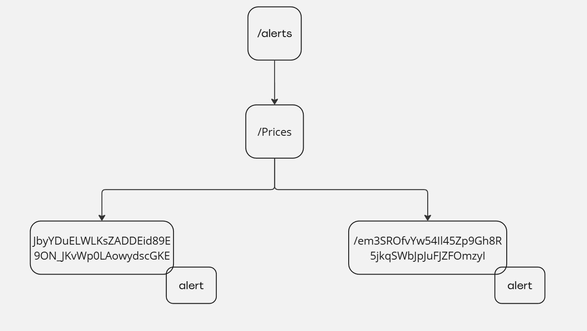

# ms-backend

# Introducción



El servicio **ms-backend** es un componente que provee una API REST para ser consumida por el frontend. Este servicio se conecta a una base de datos **MongoDB** para obtener información relacionada con monitoreos e historiales (“historical”). Para algunas solicitudes, es necesario realizar **aggregations** que permiten mostrar los datos de la manera esperada por el frontend.

# **Configuración de Índices de Colecciones**

**ms-backend** permite configurar los índices de las colecciones en la base de datos con el objetivo de optimizar ciertas operaciones, como las aggregations realizadas para las promociones (**Promotions**). La configuración se define en el archivo de propiedades de la siguiente manera:

```yaml
database:
  indexes:
    - collection: "PromotionPosTest"
      field: "store"
      type: "number"
      direction: "ASC"
      unique: false
    - collection: "PromotionStoresTest"
      field: "store"
      type: "number"
      direction: "ASC"
      unique: false
    - collection: "PromotionStoresTest"
      field: "format"
      type: "text"
      unique: false
```

Esta configuración es importante para optimizar las aggregations que se realizan sobre las colecciones relacionadas con las promociones. En caso de que la información de **Promotions** no sea necesaria, esta configuración puede ser omitida.

# Definición de Nombres de Colecciones (Monitoreo e Historical)

El servicio permite definir los nombres de las colecciones de monitoreo y historical. Esta configuración es esencial para facilitar la conexión y el acceso a la información dentro de MongoDB. La configuración de las colecciones se realiza de la siguiente forma:

- **Colecciones de Monitoreo**:
    
    ```yaml
    collectionNames:
      tef: "Tef"
      eod: "WebfrontEOD"
      fel: "FEL"
      felPos: "FelPos"
      host: "Host"
      level: "Levels"
      price: "Prices"
      rule: "Rules"
      version: "Version"
      hardware: "Hardware"
      tefDetails: "TefDetails"
      transaction: "Transaction"
      promotionPos: "PromotionPos"
      serviceStatus: "ServiceStatus"
      promotionStore: "PromotionStores"
      promotionCentral: "PromotionCentrals"
      asls: "Asls"
    ```
    
- **Colecciones de Historical**:
    
    ```yaml
    historicalCollectionNames:
      eod: "WebfrontEOD_historical"
      hardware: "Hardware_historical"
      host: "Host_historical"
      price: "Prices_historical"
      promotion: "Promotion_historical"
      serviceStatus: "ServiceStatus_historical"
      transaction: "Transaction_historical"
      version: "Version_historical"
    ```
    

# **Creación de Alertas para Notificaciones**

En caso de que las notificaciones estén habilitadas, **ms-backend** provee controladores que permiten agregar o eliminar alertas. Estas alertas serán utilizadas por el servicio **ms-worker-notifications** para gestionar las notificaciones correspondientes.

### Zookeeper

Para que la funcionalidad de **reportes** opere correctamente, es necesario configurar Zookeeper utilizando ciertos parámetros clave. A continuación, se presenta una configuración de ejemplo con una explicación de cada uno de los campos:

```yaml
curator:
  enabled: true
  connectString: localhost:2181
  sessionTimeoutMs: 60000
  connectionTimeoutMs: 15000
  sleepMsBetweenRetries: 100
  maxRetries: 3
```

- **enabled**: Este parámetro activa o desactiva el uso de Curator, el cliente que facilita la interacción con Zookeeper. **Si el parámetro esta deshabilitado no se conectara a Zookeeper.**
- **connectString**: Define la dirección del servidor Zookeeper al que la aplicación se conectará. En este ejemplo, se está conectando a un servidor local en el puerto 2181.
- **sessionTimeoutMs**: Especifica cuánto tiempo una sesión con Zookeeper puede estar inactiva antes de ser cerrada. En este caso, el tiempo límite es de 60 segundos (60000 ms).
- **connectionTimeoutMs**: Este parámetro establece cuánto tiempo la aplicación intentará conectarse a Zookeeper antes de darse por vencida. Aquí está configurado en 15 segundos.
- **sleepMsBetweenRetries** y **maxRetries**: Estos valores controlan la lógica de reintentos si la conexión a Zookeeper falla. Se espera 100 milisegundos entre intentos, y se realizarán un máximo de 3 intentos.

Además, se debe definir la ruta en Zookeeper donde se almacenarán las alertas. La configuración de esta ruta puede variar según las necesidades del proyecto. Un ejemplo básico sería:

```yaml
alerts:
  path-config: /alerts
```

- **path-config**: Especifica la ruta en Zookeeper donde las alertas se almacenarán o enviarán. En este ejemplo, la ruta es `/alerts`, pero puede ser personalizada según el contexto del sistema

## Formato de alertas

```json
{
  "type": <type>,
  "cron": <cron>,
  "regex": <regex>,
  "channels": {
    "telegram": {
      "recipients": [""]
    },
    "email": {
      "recipients": [""]
    }
  }
}
```

- **type**: Define el nivel de criticidad de la alerta (por ejemplo, CRITICAL).
- **cron**: Define la frecuencia con la que se debe evaluar la alerta.
- **regex (opcional)**: Define un patrón para determinar las entidades afectadas (por ejemplo, si esta configurada la regex POS-* los únicos host que serán analizados serán lo que cumplan el patrón de la regex).
- **channels**: Define los canales de notificación y sus respectivos destinatarios, como **Telegram** y **Email**.

## Generación de Nodos en Zookeeper para alertas

El sistema de almacenamiento de alertas en Zookeeper organiza las alertas bajo un nodo raíz. Por ejemplo,`/alerts`. Dentro de este nodo, se estructuran las alertas en función del `scriptType` y se utilizan hashes únicos para identificar cada alerta. La estructura jerárquica de los nodos es la siguiente:

1. **Nodo Raíz**: `/alerts` (configurable mediante alerts.path-config)
    - Este nodo es donde se almacenan todas las alertas.
2. **Subnodos por ScriptType**:
    - Cada tipo de script tiene su propio subnodo dentro de `/alerts`. Ejemplos de `scriptType` pueden ser `Prices`, `WebfrontEOD`, etc.
    - Estructura de ejemplo: `/alerts/Prices`
3. **Subnodos Hash**:
    - Dentro de cada nodo de `scriptType`, se generan nodos cuyo nombre es un hash único basado en la información de la alerta. El hash se genera utilizando la concatenación de tres parámetros clave: `scriptType`, `type` y `regex`.
    - Fórmula del hash: `hash = hash(scriptType + type + regex)`
    - Ejemplo de estructura: `/alerts/Prices/JbyYDuELWLKsZADDEid89E9ON_JKvWp0LAowydscGKE`(donde `JbyYDuELWLKsZADDEid89E9ON_JKvWp0LAowydscGKE`es el hash generado).
4. **Almacenamiento de Información de Alerta:**
    
    Dentro de cada nodo de hash se guarda la información completa de la alerta. La información se almacena como data del nodo Zookeeper correspondiente.
    



### Ventajas de esta Estructura

- **Unicidad de Alerta**: El uso de un hash basado en `scriptType`, `type` y `regex` garantiza que cada alerta tenga un identificador único, evitando duplicidades en el almacenamiento.
- **Eficiencia en la Búsqueda**: La estructura jerárquica permite acceder rápidamente a las alertas filtrando por `scriptType`, lo que facilita la búsqueda y consulta de alertas específicas.
- **Escalabilidad**: Zookeeper maneja la creación de miles de nodos eficientemente, por lo que esta estructura permite el manejo de un número grande de alertas sin impactar el rendimiento.

# Configuración en base a perfiles

El servicio `ms-backend` utiliza perfiles para dividir su configuración en diferentes partes, permitiendo así adaptar su comportamiento según las necesidades específicas del entorno o contexto. Cada perfil corresponde a un conjunto de configuraciones específicas que se activan de acuerdo con el perfil seleccionado.

Por ejemplo, si se usa el perfil `life-cycle`, en el servicio `ms-config` debería existir un archivo denominado `ms-backend-life-cycle` que contenga la configuración específica para el perfil `life-cycle`. De esta manera, se garantiza que el servicio `ms-backend` utilice los parámetros adecuados para el contexto de ciclo de vida.

De manera similar, si se utiliza el perfil `rules`, en el `ms-config` debería haber un archivo llamado `ms-backend-rules`, que incluirá la configuración específica necesaria para manejar reglas dentro del servicio. Estos archivos permiten centralizar y organizar de manera clara las configuraciones correspondientes a cada perfil, haciendo que la gestión del servicio sea más eficiente y sencilla.

Esta estructura de perfiles permite al `ms-backend` adaptarse a diferentes escenarios sin necesidad de modificar la configuración base, manteniendo la flexibilidad y facilitando el mantenimiento del sistema.