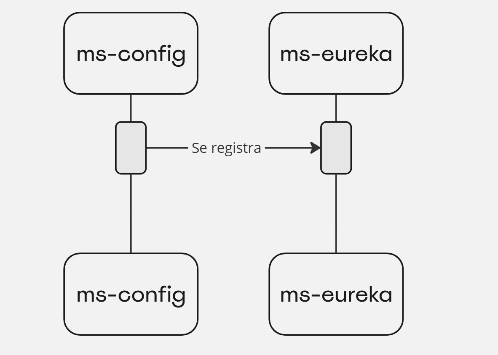

# ms-config

# Introducción



El servicio **ms-config** es un componente dentro del ecosistema que se encarga de la administración centralizada de configuraciones. Este servicio hace uso de **Spring Cloud Config** para gestionar los valores de configuración de manera eficiente y consistente a través de todas las aplicaciones.

**Spring Cloud Config** permite almacenar las configuraciones en un repositorio remoto (comúnmente Git) o en una carpeta local, lo que facilita su administración y versionado. En nuestro caso, utilizamos una carpeta local en lugar de Git. Esto permite a **ms-config** proporcionar configuraciones a las diferentes instancias de los servicios, manteniendo consistencia y flexibilidad en la configuración de cada ambiente (desarrollo, pruebas, producción).

De esta manera, el servicio **ms-config** centraliza la configuración, permitiendo a los desarrolladores y equipos de operaciones realizar cambios sin necesidad de desplegar nuevamente las aplicaciones, contribuyendo a la eficiencia y estabilidad del sistema en general. Con el uso de **spring-cloud-starter-bus-ampq**, los servicios se actualizan automáticamente cuando se realiza un cambio en la configuración centralizada, sin necesidad de reiniciar cada servicio.

# Configuración

```bash
spring:
  cloud:
    config:
      server:
        native:
          # Esta propiedad indica el directorio donde se almacenan los archivos de configuración.
          search-locations: <path>
      monitor:
        # Esta propiedad habilita/deshabilita la monitorización del servidor de configuración.
        # Si está habilitado, el servidor de configuración puede detectar cambios en los archivos de configuración y notificar a los clientes.
        enabled: true
```

El valor de la propiedad **spring.cloud.config.server.native.search-locations** puede variar dependiendo del Sistema Operativo en el que se esté ejecutando la aplicación.

- Para Windows:
En Windows, la ruta del archivo de configuraciones se especifica con el prefijo `file:` seguido de la ruta completa la carpeta donde se encuentran los archivos de configuración.
- Para Linux:
En Linux la ruta del archivo de configuración también se especifica con el prefijo `file:` pero la ruta debe estar en el formato adecuado para Linux.

# Enlaces utiles

[Spring Cloud Config](https://docs.spring.io/spring-cloud-config/docs/current/reference/html/#_quick_start)

[7. Spring Cloud Config Client](https://cloud.spring.io/spring-cloud-config/multi/multi__spring_cloud_config_client.html)