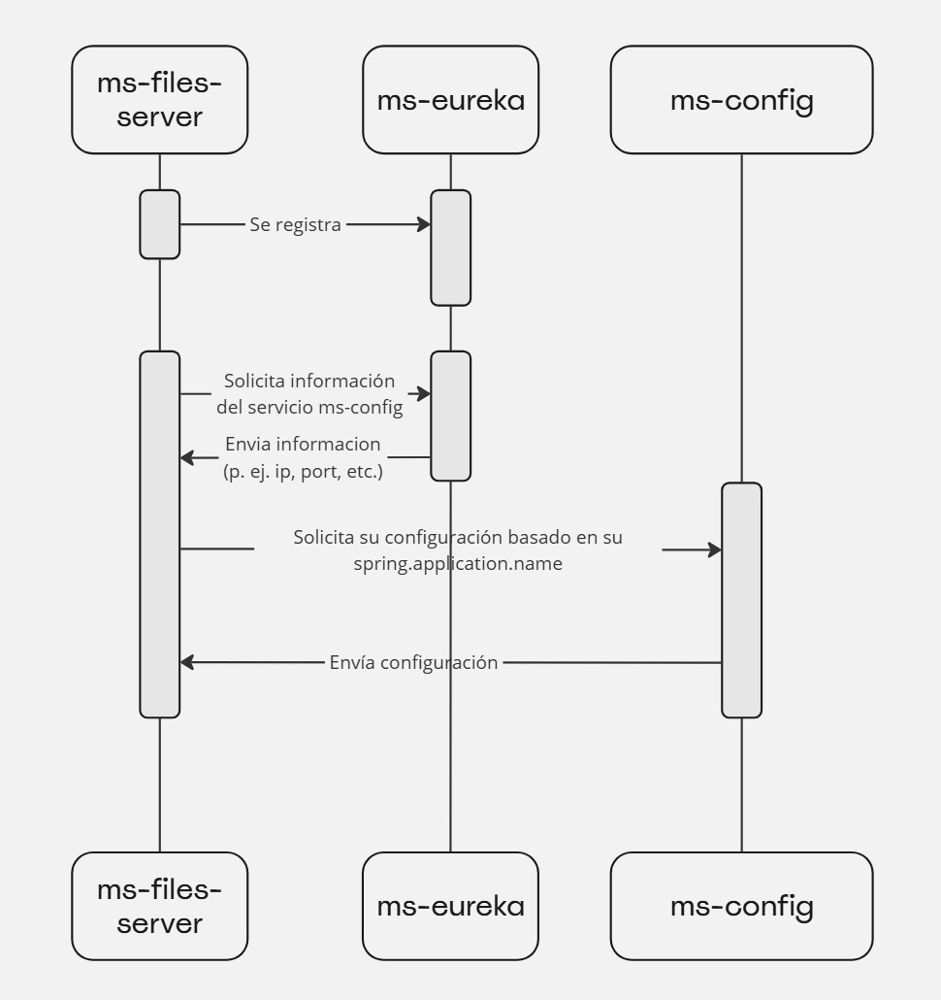

# ms-files-server

# Introducción



`ms-files-server` es un servicio desarrollado para servir archivos estáticos desde una ubicación específica en el sistema de archivos local. Permite a los usuarios acceder a estos archivos a través de una URL pública, facilitando la distribución de contenido estático, como documentos, scripts, imágenes, etc. Este servicio es útil para entornos en los que se necesita compartir recursos de manera rápida y sencilla sin la necesidad de un servidor de aplicaciones más complejo.

# Configuración del servicio

## **Ruta estática**:

```
static-path-pattern: /files/**
```

La propiedad `static-path-pattern` define un patrón de ruta estática para los archivos del servidor. En este caso, cualquier solicitud que coincida con el patrón `/files/**` será manejada como una ruta estática.

Los archivos se pueden acceder mediante el patrón que fue configurado en la propiedad `static-path-pattern`. En este caso, si la propiedad tiene el valor `/files/**`, la forma de acceder sería:
`http://<host>:<puerto>/files/<nombre_del_archivo>`
**Ejemplo**: `http://localhost:8080/files/example.txt` serviría el archivo `example.txt` desde la ubicación configurada.

## **Ubicación de los archivos**:

```
root-static-files: file:///<path>
```

Esta propiedad define la ubicación de los archivos estáticos en el sistema de archivos. Utiliza el prefijo `file:///` para indicar que la ubicación es una ruta local.

Es importante que la ruta termine con `/` para indicar que la ubicación especificada es un directorio. Esta es una convención común en muchos sistemas operativos y en el manejo de URLs.

Los archivos se almacenan en una estructura de carpetas en la ubicación especificada por `root-static-files`. Debe asegurarse de que la ruta tenga permisos de lectura para el servicio.

# Header If-None-Match

`ms-files-server` utiliza el header `If-None-Match` si se encuentra en la petición de un archivo para determinar si la versión local del servicio que solicita este archivo es la misma que tiene el `ms-files-server`. Este header contiene un valor MD5 y `ms-files-server` compara el MD5 enviado por el header con el MD5 del archivo local que posee.


# Enlaces útiles

[Download a Large File Through a Spring RestTemplate | Baeldung](https://www.baeldung.com/spring-resttemplate-download-large-file)