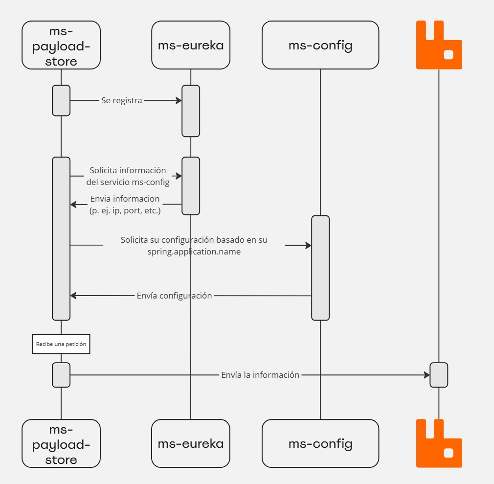

# ms-payload-store

# Introducción



El servicio ms-payload-store provee una API sencilla que no realiza validación de los datos recibidos. Su única función es recibir información a través de peticiones y enviar la información a RabbitMQ.

# Endpoints

## 1. API de Script

Esta API está destinada a manejar la información de scripts.

### Endpoint

`/api/v1/script/{type}`

### Método

`POST`

### Headers

- `Content-Type: application/json`

## 2. API de IoT

Esta API está diseñada para gestionar dispositivos IoT.

### Endpoint

`/api/v1/iot/{type}`

### Método

`POST`

### Headers

- `Content-Type: application/json`

# Envió de la información a RabbitMQ

El servicio `ms-payload-store` se encarga de enviar información a diferentes colas en RabbitMQ. Por defecto, este servicio utiliza un **exchange personalizado** (representado como `""` en la configuración) para dirigir la información a las colas configuradas. La asignación de las `routingKeys` es dinámica y se puede ajustar fácilmente a través de la configuración del servicio.

## Configuración de routingKeys

Dentro de la configuración del servicio, se define cómo deben estructurarse las `routingKeys` para los diferentes tipos de información, ya sea información relacionada con IoT o scripts. Para personalizar las `routingKeys`, simplemente se utiliza el patrón `${type}`, el cual se sustituirá automáticamente por el tipo de información que se está enviando (por ejemplo, un tipo de script o de IoT).

```yaml
payload-store:
  iot:
    routing-key-pattern: ${type}
  script:
    routing-key-pattern: ${type}
```

## Uso de `custom-queues`

Una de las características avanzadas del `ms-payload-store` es la capacidad de configurar ciertas colas con un comportamiento especial que difiere del comportamiento por defecto. Esto se logra mediante la definición de `custom-queues`, las cuales pueden agregarse en la cantidad que sea necesaria según los requerimientos del sistema.

### Ejemplo de `custom-queues`

En el siguiente ejemplo, vemos la configuración de una cola personalizada llamada `PromotionCentrals`, donde se especifica un `exchange` llamado `delayed_exchange` y se establece un retraso de 10 segundos en el encabezado del mensaje.

```yaml
yaml
Copiar código
payload-store:
  script:
    routing-key-pattern: ${type}
    custom-queues:
      PromotionCentrals:
        routing-key: PromotionCentrals
        exchange: delayed_exchange
        headers:
          x-delay: 10000

```

### Explicación del ejemplo

- **routing-key**: Para la cola `PromotionCentrals`, se ha definido una `routing-key` fija, es decir, siempre será `PromotionCentrals` sin importar el tipo de script o IoT que se esté enviando.
- **exchange**: Se utiliza el `delayed_exchange` en lugar del exchange por defecto. Este tipo de exchange permite añadir un retraso en el enrutamiento de los mensajes.
- **headers**: Se ha configurado un retraso de 10 segundos para el procesamiento del mensaje. Este valor se define en el header `x-delay` y asegura que los mensajes no se entreguen inmediatamente.

### Agregar múltiples `custom-queues`

Es posible agregar la cantidad de `custom-queues` que se requieran dentro de la configuración del servicio `ms-payload-store`. Cada una de estas colas puede tener su propia configuración de `routing-keys`, exchanges y otras características, brindando flexibilidad a la hora de manejar diferentes flujos de datos.

## Importancia de `PromotionCentrals`

En el caso particular de la cola `PromotionCentrals`, esta **debe estar siempre configurada** si se quiere llevar a cabo correctamente el proceso de `MergeDP`. Su ausencia en la configuración podría afectar la funcionalidad esperada para este flujo de datos específico.