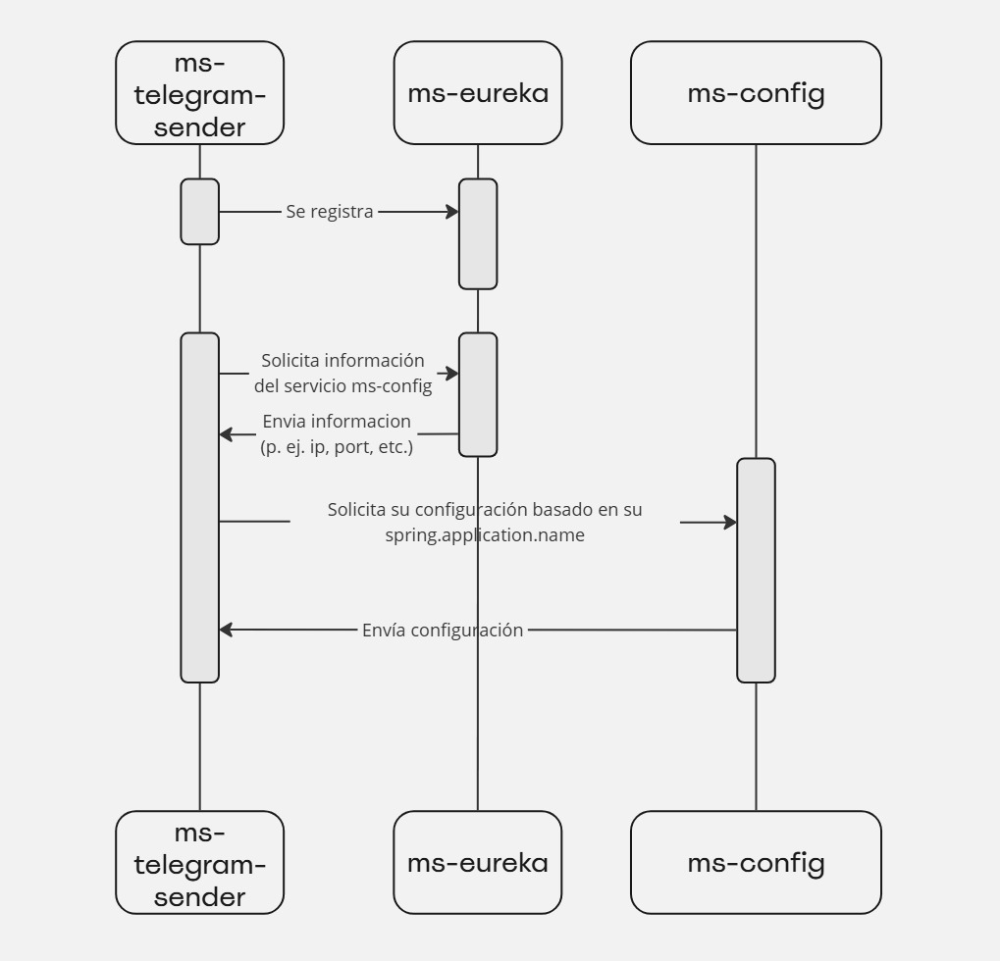

# ms-telegram-sender

# Introducción



El servicio `ms-telegram-sender` tiene como función principal interactuar con la API de Telegram. Este servicio se encarga de enviar mensajes a usuarios o grupos de Telegram

## Crear un bot para enviar mensajes

Para poder enviar mensajes mediante este servicio, primero es necesario crear un bot en Telegram utilizando `@BotFather`. `@BotFather` proporciona todos los pasos necesarios para crear el bot y obtener el token de acceso (API_KEY).

Una vez obtenido el API_KEY, debes configurarlo en el archivo de configuración del servicio para que pueda utilizar la API de Telegram al enviar mensajes. La configuración debe verse de la siguiente manera:

```yaml
telegram-sender:
  api-key: <TU_API_KEY>
```

# Assets

Para gestionar los assets, se utiliza Markdown junto con el motor de plantillas **FreeMarker**. La configuración del path donde se almacenan los assets creados en **FreeMarker** se define mediante la siguiente propiedad:

```yaml
telegram-sender:
  path-assets: <path>
```

Esta configuración se combina con el sistema de MarkdownV2 de Telegram, permitiendo generar contenido dinámico en formato Markdown. Todos los archivos deben tener la extensión `.md`.

En caso de que no exista un archivo `.md` con el mismo nombre que el `scriptType` o si el archivo correspondiente falla, se utiliza un asset por defecto ubicado en la carpeta de assets, con el nombre `default.md`, garantizando así que el contenido se genere de manera consistente.

## Enlaces

[FreeMarker Java Template Engine (apache.org)](https://freemarker.apache.org/index.html)

# Mecanismos para Enviar Mensajes

El servicio `ms-telegram-sender` ofrece dos mecanismos principales para enviar mensajes a usuarios o grupos de Telegram.

## Cuerpo de la respuesta

Para ambos mecanismos el cuerpo de la respuesta tiene la siguiente forma:

| Campo | Tipo | Descripción | Obligatorio |
| --- | --- | --- | --- |
| to | List<String> | Direcciones de correo electrónicos destinatarios. | Si |
| template | Map<String, Object> | Contiene la información necesaria para construir el correo con el uso de un template. | Si |
| attachments | List<Map<String, String>> | Contiene la información necesaria para archivos que deben ir adjuntos al correo. | No |

### Descripción de los campos de *template*

| Campo | Tipo | Descripción | Obligatorio |
| --- | --- | --- | --- |
| name | String | Contiene el nombre del template a utlizar. NO CONTIENE LA EXTENSION. | Si |
| options | Map<String,  Object> | Contiene los parámetros o variables que serán usados o sustituidos en la plantilla para generar el contenido final | SI |

### Consideraciones especiales

- El campo *options* debe ser flexible porque es muy variable lo que puede enviar.

### Descripción del campo *attachments*

| Campo | Tipo | Descripción | Obligatorio |
| --- | --- | --- | --- |
| filename | String  | Contiene el nombre del archivo. | SI |
| content | String | Contiene el archivo en un formato de texto. | Si |
| enconding | String | Contiene el encodings del archivo en formato de texto. | Si |
| contentType | String | Se usa para especificar el tipo de dato que está siendo enviado. El formato es en MIME Types. | Si |

### Ejemplo

```json
{
   "to":[
      "-1002227513279"
   ],
   "template":{
      "name":"prices",
      "options":{
         "scriptType":"Prices",
         "type":"CRITICAL",
         "dateExecutionNotificaton":"2021-04-27T13:00:00",
         "reports":[
            {
               "status":"CRITICAL",
               "host":"POS-1-5530",
               "timeExecution":"2023-11-23T00:24:02.364+00:00"
            },
            {
               "status":"CRITICAL",
               "host":"POS-2-5530",
               "timeExecution":"2023-11-23T00:24:02.364+00:00"
            }
         ]
      }
   },
   "attachments":[
      {
         "filename":"pricesReport160924.pdf",
         "content":"JVBERi0xLjcKJeLjz9MKNSAwIG9iago8PC9GaWx0ZXIvRmxhdGVEZWNvZGUvTGVuZ3RoIDg0OT4+c3RyZWFtCnicpZhLbxMxEIDv+yt8LIcO9vjdW6nKQ0I80pU4IxqkIkpomwI/n9ldJ+NKjTOSm0Myqj97P3u8ftwNr8bh5WujUKvx+4ABwQQVk4aU1Hg9oBrvBw2B/qL6O5ys1r8399uHF+OP4XIcPg93O97gxBtDoIoeIYUKdxP6dvOwPcQhNYj5AHi1/bp9PNiksxro1/PoeHO7Vpf/1t8etzebX1UVWk2f1Rsq6KmgJWfnwarbwftcfv8crp4ri+ToqMEQISYCdnGLscmBT8zs4iYTuPz8UEtwsDSgrxpYwlb93ieIvm5jiZ8wT7o6Zcj0HNThdk6Ok08fr07x1HurDw5s1HNCMXOxeje+uzh/f4iwmVqJNfFlfa0+bP4oRIXmDN2ZRnW+GqcKTtTBtCAbS6NikDJhqgU12kOFF7EwfZm9mJeIVYxQrCJ6xEI0kO1xswDBq+AyOL83M1qkxpBUjYkuNWvARemg6TR97dSSyIwZqRkTPWa+DPzxEfMhgUcesSzxqiChV0V0eXl6pUinmccEOuzVZGbMSM2Y6DKjl7tOQjOXInjOxSAxqxihWUX0mLmQIUjT0bkIxnI6OpEaQ1I1JrrUMIPxUjVNX5GXM9G7sYKkakz0qNmUIAjycVazgXYBPGiilZoZoRgDXV4uAaJwnln0EB2LibyYkYox0WWmaX8VhCOGyQNyMpooUasgoVpF9KghbR0xS9Wcg8S7KyNaqStIqsZElxoGSILt1ZyPqB1Y3l5ZkRkzUjMmeswMDYcV5ONsZoItB8HZTPTarxihWUV0mdHJRZCNixja6dC2ExPNs4qRijHRJaY9OMH2ap5nCSFXW33RKYYZoRgDXRt9N9V1TGu3gNJBrmPXUxb7fSVz54hWDmae6ZznT+E0U5OtjtRL3Dy5B+oMG5kpcZuh9KITBTNL3GR8slMu7ZkStxnqglxdEZS4zWgEXz1biZuMCwjaM1PiNoNm2g0zs8RNxiYzXRntmRK3GTfdglXMErcZTQlUPVuJmwz6DLHKnRK3GZOn5ZyZJW4yJiaohnQJ24SlSVtlTombTI6QqgdbwnbeRHB12szhkZu4cnNXwqWeIxdxBSlhGwnl/8s13JGyfO22u4RrAk8u3ThRKuQ/8dOMJAplbmRzdHJlYW0KZW5kb2JqCjQgMCBvYmoKPDwvQ29udGVudHMgNSAwIFIvTWVkaWFCb3hbMCAwIDU5NSA4NDJdL1BhcmVudCAyIDAgUi9SZXNvdXJjZXM8PC9Gb250PDwvRjEgNiAwIFI+Pj4+L1RyaW1Cb3hbMCAwIDU5NSA4NDJdL1R5cGUvUGFnZT4+CmVuZG9iago4IDAgb2JqCjw8L0ZpbHRlci9GbGF0ZURlY29kZS9MZW5ndGggMzk1Pj5zdHJlYW0KeJyllF9PwjAUxd/7KfqID1y72/a25Q0JKonxDyzx2QgmGJEgQ/34djC2zqxjCVmy7Szn19vTtXfDrlJ2eZ3wBHn6xpJEgOXG+bvk6Zz5j19MgOI/rHe73mYX6Tsbp+yJbeocWgHoIuAse8l22xiqpAD/1oymy9WCj38Xr7tsuf4MhhA8v6Y33qi9URI3VgIavmJau6P4YLMmN/qUCrkVGoz2RKHbIWkVaFtBhT4BUQXk8ypE1A2ogwp72V5Aa5ubgyJ7/Q+qL7i3SJ+W/EPnC95DgTL2eywB+fGUBmv25seHWT+hvtZSRHeD8b+UQmg0naST0fAuRkjnwJmQeF7M+f36myNyTAaoBgL5cJrmA/R4dC8V0dCAtV2j+aVTZTJMOiUrma7BSuCcXGRNvk+75SJS4KpgiewSLIA6JguIs6IpAkdN0RrPiCEBxgX7/aBbz5VBkVeqmINuZcg4sFQxhW7vK2UnKjRJBzI+uVofKfvKCYiOhkNfOeUOGsmxr7Qj9T5S5Q+hP1ReSqEKZW5kc3RyZWFtCmVuZG9iago3IDAgb2JqCjw8L0NvbnRlbnRzIDggMCBSL01lZGlhQm94WzAgMCA1OTUgODQyXS9QYXJlbnQgMiAwIFIvUmVzb3VyY2VzPDwvRm9udDw8L0YxIDYgMCBSPj4+Pi9UcmltQm94WzAgMCA1OTUgODQyXS9UeXBlL1BhZ2U+PgplbmRvYmoKMSAwIG9iago8PC9QYWdlcyAyIDAgUi9UeXBlL0NhdGFsb2c+PgplbmRvYmoKMyAwIG9iago8PC9DcmVhdGlvbkRhdGUoRDoyMDI0MDkxNjE5NTAwMS0wMycwMCcpL01vZERhdGUoRDoyMDI0MDkxNjE5NTAwMS0wMycwMCcpL1Byb2R1Y2VyKGlUZXh0riA3LjEuMTAgqTIwMDAtMjAyMCBpVGV4dCBHcm91cCBOViBcKEFHUEwtdmVyc2lvblwpKT4+CmVuZG9iago2IDAgb2JqCjw8L0Jhc2VGb250L0hlbHZldGljYS9FbmNvZGluZy9XaW5BbnNpRW5jb2RpbmcvU3VidHlwZS9UeXBlMS9UeXBlL0ZvbnQ+PgplbmRvYmoKMiAwIG9iago8PC9Db3VudCAyL0tpZHNbNCAwIFIgNyAwIFJdL1R5cGUvUGFnZXM+PgplbmRvYmoKeHJlZgowIDkKMDAwMDAwMDAwMCA2NTUzNSBmIAowMDAwMDAxNjU5IDAwMDAwIG4gCjAwMDAwMDE5NTAgMDAwMDAgbiAKMDAwMDAwMTcwNCAwMDAwMCBuIAowMDAwMDAwOTMxIDAwMDAwIG4gCjAwMDAwMDAwMTUgMDAwMDAgbiAKMDAwMDAwMTg2MiAwMDAwMCBuIAowMDAwMDAxNTI2IDAwMDAwIG4gCjAwMDAwMDEwNjQgMDAwMDAgbiAKdHJhaWxlcgo8PC9JRCBbPDZmZDBjOTlhYjRhMzJjZmUyNzAxY2UyZjU0YzRhNTdkPjw2ZmQwYzk5YWI0YTMyY2ZlMjcwMWNlMmY1NGM0YTU3ZD5dL0luZm8gMyAwIFIvUm9vdCAxIDAgUi9TaXplIDk+PgolaVRleHQtNy4xLjEwCnN0YXJ0eHJlZgoyMDA3CiUlRU9GCg==",
         "encoding":"base64"
         "contentType": "application/pdf"
      }
   ]
}
```

## Mediante API

El envío de mensajes mediante la API se realiza a través de una llamada HTTP POST. Un ejemplo de cómo hacerlo utilizando `curl` es el siguiente:

```bash
curl --location '/api/v1/sendMessage' \
--header 'Content-Type: application/json' \
--data <insertar_data>
```

## Mediante RabbitMQ (opcional)

También es posible enviar mensajes utilizando RabbitMQ como intermediario. Este mecanismo permite enviar mensajes de forma asincrónica, delegando la tarea de envío a una cola de mensajes, lo cual puede ser útil para escenarios de alta carga o en los que no se necesite una respuesta inmediata.

Si el exchange definido (de tipo `headers`) o la cola (`queue`) especificados en la configuración no existen, el servicio `ms-telegram-sender` los creará automáticamente en RabbitMQ. El exchange será de tipo `headers` y el binding entre la cola y el exchange requerirá definir los argumentos (`args`). Los args son dinámicos y su configuración depende los casos de uso o las configuracion que se esperan en rabbitMQ. Un ejemplo podria ser que se espere que cada servicio se encarque espeficamente de un tipo de script (scriptType) y eso se deberia configurar en args de la siguiente forma.

```yaml
  rabbitmq:
    enabled: true
    queue:
      name: telegram_queue
      exchange:
        name: telegram-exchange
        args:
          scriptType: <script_type>

```