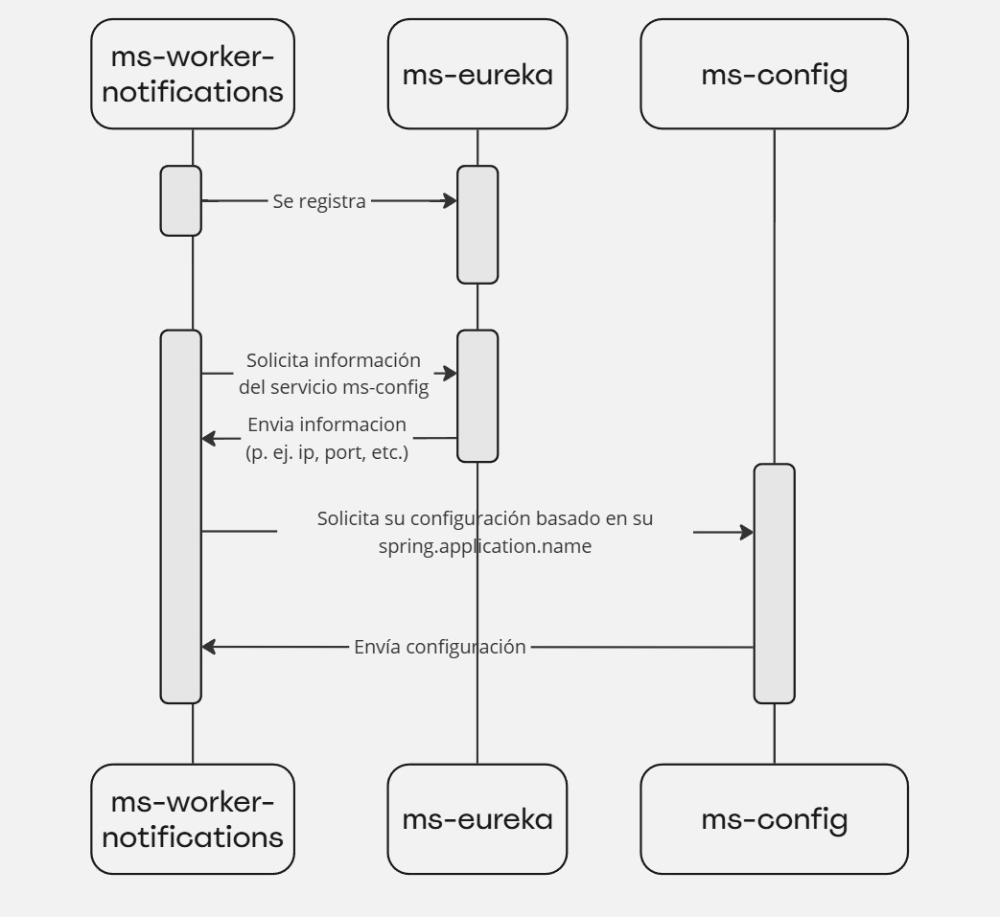
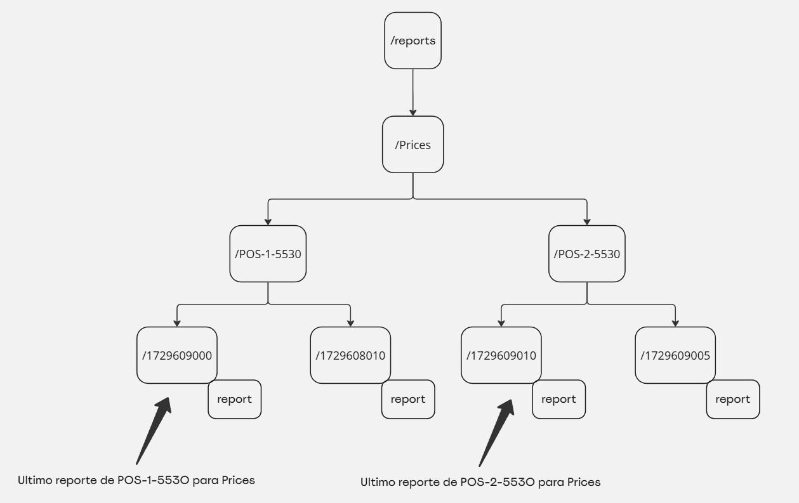

# ms-worker-notifications

# Introducción



El servicio `ms-worker-notifications` tiene como función principal gestionar notificaciones dentro de la arquitectura distribuida del sistema. Este servicio utiliza Zookeeper para coordinar y asignar responsabilidades según el rol que cumpla dentro de la topología, ya sea como líder o no líder.

# LeaderLatch

El `LeaderLatch` es una utilidad de Apache Curator que facilita la implementación de una selección de líder en entornos distribuidos usando ZooKeeper. Básicamente, permite que varias instancias de un servicio o aplicación compitan para obtener el rol de líder, pero solo una de ellas será seleccionada como líder en un momento dado. Si la instancia líder falla o se desconecta, el `LeaderLatch` automáticamente organiza una nueva elección para designar otro líder.

# **Funcionamiento del Servicio**

## **Rol de Líder:**

Cuando el servicio `ms-worker-notifications` adquiere el rol de líder, establece una conexión con Zookeeper y accede al nodo de alertas configurado en:

```yaml
worker-notifications:
  alerts:
    path-config: <path-config>
```

<aside>
💡

El servicio `ms-worker-notifications`, cuando se encuentra en estado de líder, utiliza un watcher para monitorear cualquier modificación en el nodo de alertas. Si se detecta un cambio en este nodo, el servicio detiene los schedulers que han sido configurados previamente y procede a crear nuevos schedulers, ajustados según la información actualizada. Esta estructura asegura que el sistema siempre esté operando con los datos más recientes para gestionar las notificaciones de manera precisa.

</aside>

Con esta información, el líder supervisa periódicamente los nodos configurados para almacenar reportes, ejecutando tareas programadas (*schedulers*) que verifican si hay coincidencias con los criterios definidos. Esta supervisión asegura que cualquier evento relevante sea identificado y procesado de manera oportuna.

La configuración de los nodos de reportes es la siguiente:

```yaml
worker-notifications:
  reports:
    path-config: <path-config>
```

### **Formato de Alertas**

El formato de las alertas tiene la siguiente estructura JSON:

```json
json
Copiar código
{
  "type": "<type>",
  "cron": "<cron>",
  "regex": "<regex>",
  "channels": {
    "telegram": {
      "recipients": [""]
    },
    "email": {
      "recipients": [""]
    }
  }
}

```

- **type**: Define el nivel de criticidad de la alerta (por ejemplo, `CRITICAL`).
- **cron**: Especifica la frecuencia con la que se debe evaluar la alerta.
- **regex** (opcional): Define un patrón para identificar las entidades afectadas. Por ejemplo, si se configura con `POS-*`, solo se analizarán los hosts que cumplan este patrón.
- **channels**: Define los canales de notificación y sus respectivos destinatarios, tales como **Telegram** y **Email**.

### **Procesamiento de Alertas**



El líder utiliza la información de las alertas para revisar los reportes almacenados en el nodo configurado como `scriptType`. En el nodo de `scriptType`, se almacenan múltiples subnodos donde el nombre de cada subnodo corresponde a un host. El líder analiza qué hosts deben ser considerados para cada alerta según el patrón `regex` configurado.

Dentro de cada nodo de host, se crean subnodos cuyo nombre representa una fecha en formato Unix Timestamp, los cuales contienen la información del reporte directamente en el nodo. Al revisar esta información:

1. **Comparación de Alertas y Status**: El líder verifica si el `type` de la alerta coincide con el `status` actual del host.
2. **Marcado de Nodos Leídos**: Cuando se detecta una coincidencia, `ms-worker-notifications` verifica si el nodo ya ha sido enviado como notificación con la alerta actual. Si el nodo no ha sido notificado previamente, se marca como leído para prevenir envíos repetidos. La marcación se realiza añadiendo una propiedad `readBy` en la información del nodo, indicando que ya ha sido procesado para esta alerta específica. Esta propiedad sirve como referencia para saber si el nodo ya fue notificado, evitando que una misma alerta envíe múltiples notificaciones desde el mismo host.
    
    Este sistema es especialmente útil en entornos donde varias alertas pueden estar monitoreando el mismo nodo; al marcar cada nodo de forma individual, `ms-worker-notifications` asegura que cada alerta envíe notificaciones de manera única y controlada, sin redundancias ni conflictos entre alertas que escuchan el mismo nodo.
    
3. **Envío de Reportes**: Una vez que se analiza cada host que cumple con el `scriptType` y `regex`, y se compara el `type` de la alerta con el `status` del host, el líder envía un listado de nodos como reportes a una cola (*queue*). Esta cola es monitoreada por instancias de `ms-worker-notifications` **que no están en rol de líder**, permitiendo que estas instancias procesen los reportes y actúen según las configuraciones.

## **Rol de No Líder**:

En el caso de que el servicio `ms-worker-notifications` no cumpla el rol de líder, este permanece en estado de escucha de una cola (*queue*). La información que recibe desde la cola es procesada por el servicio y posteriormente se envía a un *exchange* para que otros servicios la gestionen y envíen la notificación al usuario final.

El nombre de la cola se configura de la siguiente manera:

```yaml
worker-notifications:
  queue-name: <queue-name>
```

En caso de que la cola no exista, `ms-worker-notifications` la creará automáticamente.

Para configurar los *exchanges*, se hace de la siguiente manera:

```yaml
worker-notifications:
  channels:
    telegram:
      exchange: <telegram-exchange>
    email:
      exchange: <email-exchange>
```

Para la integración de RabbitMQ los headers que el *ms-worker-notifications* va a enviar para los mensajes son:

| Campo | Tipo | Descripción |
| --- | --- | --- |
| type | String | Contiene el tipo de notificación que se está enviando. OK, CRITICAL o WARNING |
| scriptType | String | Contiene el tipo de script en el que se está enviando la alerta. Por ejemplo, prices, hardware. etc. |

**Estos headers siempre van a estar presentes en el mensaje**