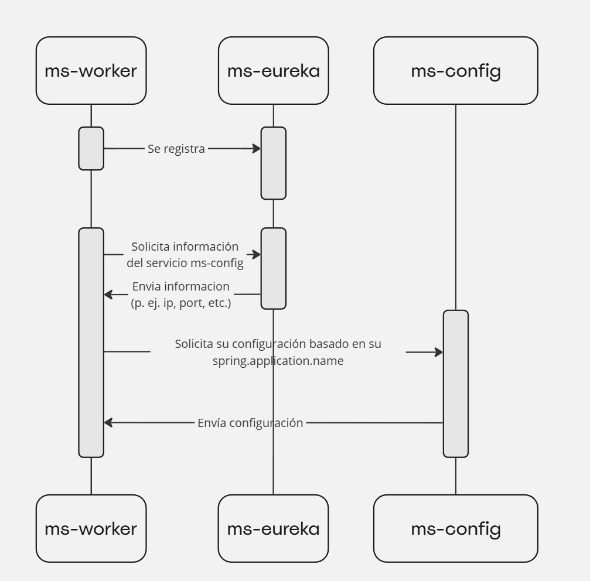
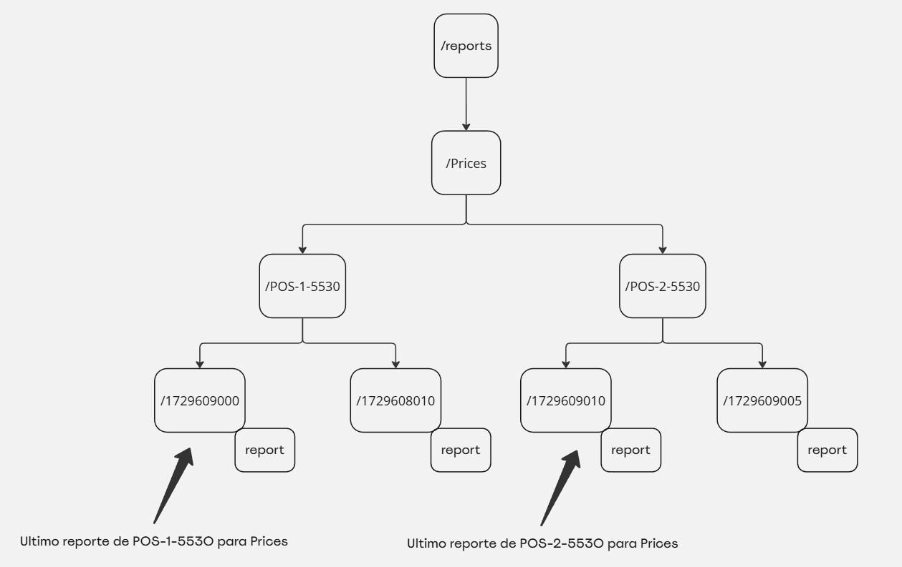

# ms-worker

# Introducción



El proyecto **ms-worker** es un microservicio desarrollado para manejar el procesamiento y almacenamiento de mensajes provenientes de **RabbitMQ**. Este servicio se encarga de guardar la información en una base de datos **MongoDB** y, en caso de estar habilitada la funcionalidad de **notifications**, enviar información adicional a **Zookeeper**.

# Configuración general

El servicio `ms-worker` es responsable de escuchar y procesar mensajes de distintas colas configuradas. Dependiendo del tipo de información, se definen tres modos de almacenamiento:

- **Monitoreo**: Siempre está presente y se utiliza para observar el estado en tiempo real. La forma en que almacena los datos es mediante un **upsert**, lo que significa que si el documento ya existe en la base de datos, se actualiza (pisa), y si no existe, se crea un nuevo documento.
- **Histórico (historical)**: Almacena toda la información recibida, manteniendo un historial completo de cada mensaje procesado.
- **Diferencia (diff)**: Solo guarda información si el estado actual de un agente es distinto al último registrado. Además, este modo puede configurarse para enviar reportes en ciertos casos.

## Exchanges

La configuración del worker permite definir exchanges personalizados con diversas opciones.

```yaml
worker:
  exchanges:
    - name: <name>
      type: <type>
      durable: <durable>
      auto-delete: <auto-delete>
      args: <args>
```

- `name`: Define el nombre del exchange.
- `type`: Especifica el tipo de exchange. por ejemplo, direct, fanout, headers, etc.
- `durable`: Indica si el exchange debe ser duradero (`true`) o no (`false`), es decir, que persista incluso si el servidor RabbitMQ se reinicia.
- `auto-delete`: Define si el exchange debe eliminarse automáticamente cuando ya no se esté utilizando. Los valores posibles son `true` o `false`
- `args`: Permite agregar configuraciones adicionales al exchange. Este recibe un Map<String, Object>

## Queues

El servicio `ms-worker` permite la configuración de un conjunto de `queues` que se van a escuchar para gestionar eventos o mensajes. A continuación, se describe la estructura de configuración para definir estas `queues` y sus respectivas propiedades.

### Configuración de `queues`

Para configurar las `queues`, la estructura tiene el siguiente formato en el archivo de configuración:

```yaml
worker:
  queues:
    script:
      Prices:
        historical:
          enabled: true
        diff:
          enabled: true
          send-report: true
```

En esta configuración se definen las `queues` bajo el nodo `worker.queues`. En el ejemplo anterior se define una `queue` llamada `Prices`, la cual tiene dos modalidades de almacenamiento:

- `historical`: Almacenamiento histórico de los mensajes recibidos.
    - `enabled`: Indica si el almacenamiento histórico está habilitado (`true` o `false`).
- `diff`: Almacenamiento de solo las diferencias entre mensajes.
    - `enabled`: Indica si la modalidad `diff` está habilitada.
    - `send-report`: Si está habilitado, se enviará un reporte basado en esta información.

### Definición de `bindings`

Opcionalmente, se puede definir un listado de `bindings` para una `queue`. Los `bindings` permiten establecer una conexión entre un `exchange` y una `queue`. La configuración de los `bindings` tiene la siguiente estructura:

```yaml
worker:
  queues:
    script:
      Prices:
        historical:
          enabled: true
        diff:
          enabled: true
          send-report: true
        bindings:
          - exchange:  <nombre_del_exchange>
            routingKey: <clave_de_enrutamiento>
            args: <argumentos_adicionales>
```

- `exchange`: Define el nombre del `exchange` que se utilizará para la `queue`.
- `routingKey`: La clave de enrutamiento que se utilizará para el `binding`.
- `args`: Argumentos adicionales para la configuración del `binding` (opcional).

### Consideraciones importantes

- Si la `queue` especificada no existe, el `ms-worker` la creará automáticamente.
- Si el `exchange` especificado en el `binding` no existe y no ha sido definido en la lista de `exchanges`, se producirá un error.
- Si el `exchange` existe o lo crea el `ms-worker` y la `queue` no existe, el sistema creará la `queue` y realizará el `binding` correspondiente entre la `queue` y el `exchange`.

# MergeDP

## Descripción general

Para la mayoría de los scripts, la información llega al sistema ya calculada y estructurada, por lo que no es necesario realizar operaciones adicionales para determinar el estado de la información o para mostrarla. Sin embargo, en el caso de **Promotions**, el proceso es diferente. La información de **Promotions** se construye a partir de tres scripts y requiere cálculos y uniones de diferentes colecciones en la base de datos para obtener la información consolidada y determinar el estado de las tiendas (**OK, WARNING, CRITICAL**).

### Proceso de Construcción de Información

1. **Script Central**: Proporciona un listado de tiendas que pertenecen a un central.
2. **Script Stores**: Envía la información de las tiendas (stores).
3. **Script POS**: Envía la información de los puntos de venta (pos) de cada tienda.

La información se integra haciendo un *lookup* desde las **stores** para obtener los datos de **central** y **pos**, lo que permite realizar los cálculos necesarios para determinar el estado de las tiendas y qué información es la que genera dicho estado.

## Orden de Procesamiento

El ms-worker recibe la información de **Promotions**, pero el orden de llegada no está garantizado. Es posible que la información de los **POS** llegue antes que la información de **Central** o de **Stores**. Esto requiere un mecanismo para consolidar la información en un punto posterior, cuando ya se tenga todo lo necesario para hacer los cálculos correctos y determinar el estado final de las tiendas.

Para garantizar que la información esté completa antes de consolidarla, se utiliza una cola especial llamada **PromotionCentrals,** la cual es configurable. Esta cola está configurada para recibir la información de los **centrales** con un **delay**, permitiendo que la información de **stores** y **pos** ya esté disponible cuando la información de **central** llegue. El valor del delay lo define el servicio **ms-payload-store.**

## Funcionamiento

Cuando la información de **Central** finalmente llega al `ms-worker`, este la guarda en la base de datos. A partir de ese momento, el `ms-worker` puede solicitar la información consolidada al `ms-backend` para almacenar los datos finales en **MergeDP**, asegurando que todos los cálculos y uniones se hayan realizado correctamente.

Esta estrategia permite asegurar que el estado de cada tienda se calcule en base a información completa y correcta, evitando inconsistencias derivadas del orden de llegada de los datos.

## Configuración

```yaml
worker:
  exchanges:
    - name: delayed_exchange
      type: x-delayed-message
      durable: true
      auto-delete: false
      args:
        x-delayed-type: direct

    dp-central:
      queue-name: PromotionCentrals
      bindings:
        - exchange: delayed_exchange
          routing-key: PromotionCentrals
          args:
            x-delayed-type: direct
      diff:
        enabled: true
        send-report: true
```

- **Exchange delayed_exchange**: Se define un exchange de tipo **x-delayed-message** que permite retrasar el envío de mensajes. Esto asegura que la información de los **centrales** llegue al final del procesamiento, después de que la información de **stores** y **pos** ya haya sido recibida.
- **Queue PromotionCentrals**: Se configura una cola llamada **PromotionCentrals** que asocia un binding con el exchange diferido mencionado. El servicio **ms-payload-store** es el encargado de enviar los mensajes de **central** con el retraso necesario.

## Generación de Nodos en Zookeeper para Reportes



La estructura de nodos en Zookeeper para la funcionalidad de reportes se organiza de la siguiente manera:

1. **Nodo Raíz Configurado**: Se define un nodo raíz que viene de la configuración, como `/reports`.
2. **Nodo de `scriptType`**: Dentro del nodo raíz, se crea un subnodo basado en el tipo de script que genera el reporte. Por ejemplo, para un tipo de script llamado "Prices", el nodo sería `/reports/Prices`.
3. **Nodos de Hosts**: Dentro del nodo de `scriptType`, se crean nodos para cada host que produce el reporte, donde cada nodo sigue el formato `HOST-ID`. Ejemplos de estos nodos son:
    - `/reports/Prices/POS-1-5530`
    - `/reports/Prices/POS-2-5530`
4. **Nodos con Timestamp**: Dentro de cada nodo de host, se crean subnodos cuyo nombre es la fecha en formato *Unix Timestamp*, los cuales contienen la información del reporte como data directamente en el nodo. Esto permite identificar el reporte más reciente al consultar siempre el nodo con el timestamp más alto. Por ejemplo:
    - `/reports/Prices/POS-1-5530/1700000000` (contiene los datos del reporte de esa fecha)

### Configuración de TTL en Zookeeper

Para asegurar que los nodos no crezcan indefinidamente, se configura un TTL (Time-To-Live) en cada nodo de reporte. Esto permite que Zookeeper elimine automáticamente los nodos una vez que expiren, liberando recursos y manteniendo la estructura limpia.

La configuración de TTL en los nodos es crítica para la gestión de la data, y se ajusta de acuerdo con los requerimientos del sistema. Se asegura que los nodos más antiguos sean eliminados automáticamente tras un período definido.

# Configuración de los nombres de las collections

Las configuraciones para definir los nombres de las colecciones en los distintos tipos de almacenamiento (monitoreo, diff, histórico, y merged-dp) son las siguientes:

```yaml
worker:
  collection-names:
    monitor: <monitor-collection-name>
    diff: <diff-collection-name>
    historical: <historical-collection-name>
    merged-dp: <merge-dp-collection-name>
```

En esta configuración, se puede utilizar el parámetro variable `${queueName}`, que será reemplazado dinámicamente por el nombre de la cola a la que el worker esté escuchando. Esto permite que los nombres de las colecciones en la base de datos se ajusten automáticamente según la cola específica, garantizando una separación clara de los datos.
La colección `MergedDP` no sigue el patrón dinámico de las demás, ya que es una colección fija usada específicamente para datos combinados.

Un ejemplo de configuración podría ser:

```yaml
worker:
  collection-names:
    monitor: ${queueName}
    diff: ${queueName}-diff
    historical: ${queueName}-historical
    merged-dp: MergedDP
```

# TTL

## Comportamiento del Campo `updateTTLInMongo`:

En el almacenamiento de tipo `diff`, la propiedad `updateTTLInMongo` permite una optimización cuando el estado del agente no ha cambiado. Si el estado es el mismo y no se genera un nuevo evento, el sistema no crea ni modifica el contenido del documento, solo actualiza el TTL en MongoDB, asegurando que los datos permanezcan disponibles por el tiempo configurado.

## Formato de configuración

```yaml
worker:
  ttl:
    historical:
      # Tiempo de vida para el almacenamiento histórico
      time: <time-ttl-historical>
      # Habilita o deshabilita el TTL para el almacenamiento histórico
      enabled: <enabled-ttl-historical>
    diff:
      # Tiempo de vida para el almacenamiento diff
      time: <time-ttl-diff>
      # Habilita o deshabilita el TTL para el almacenamiento diff
      enabled: <enabled-ttl-diff>
      # Actualiza el TTL en MongoDB si el estado es el mismo y no se genera un nuevo documento
      updateTTLInMongo: <enabled-update-ttl-in-mongo-diff>
```

Por ejemplo:

```yaml
worker:
  ttl:
    historical:
      time: 4m
      enabled: true
   diff:
     time: 3m
     enabled: true
     updateTTLInMongo: true
```

## Unidades de Tiempo Soportadas:

- **ns**: nanosegundos
- **us**: microsegundos
- **ms**: milisegundos
- **s**: segundos
- **m**: minutos
- **h**: horas
- **d**: días

## Comportamiento del Campo `updateTTLInMongo`:

En el almacenamiento de tipo `diff`, la propiedad `updateTTLInMongo` permite una optimización cuando el estado del agente no ha cambiado. Si el estado es el mismo y no se genera un nuevo evento, el sistema no crea ni modifica el contenido del documento, solo actualiza el TTL en el documento de MongoDB, asegurando que los datos permanezcan disponibles por el tiempo configurado.

# Reportes para notificaciones

La característica de **reportes** se utiliza para enviar notificaciones cuando ciertos eventos son detectados en el sistema.  Este proceso envía una parte de los documentos que recibe `ms-worker` a `Zookeeper`
**Solo los siguientes tipos de scripts pueden enviar reportes**, ya que son los únicos que tienen el atributo **status**. El resto de los scripts no incluyen este atributo y, por lo tanto, no son elegibles para generar reportes:

- Host
- Prices
- Transaction
- ServiceStatus
- WebfrontEOD
- MergeDp

## Formato de los reportes

| Campo | Descripción |
| --- | --- |
| **status** | El estado actual del sistema o proceso. Puede ser "OK", "WARNING" o "CRITICAL". |
| **host** | El identificador del host desde el cual se envía el reporte.  |
| **timeExecution** | La fecha y hora en que se generó el reporte. En formato ISO 8601. |

Por ejemplo,

```json
{
    "status": "WARNING",
    "host": "POS-20-5530",
    "timeExecution": "2023-11-23T00:24:02.364+00:00"
}
```

## Configuración

### Zookeeper

Para que la funcionalidad de **reportes** opere correctamente, es necesario configurar Zookeeper utilizando ciertos parámetros clave. A continuación, se presenta una configuración de ejemplo con una explicación de cada uno de los campos:

```yaml
curator:
  enabled: true
  connectString: localhost:2181
  sessionTimeoutMs: 60000
  connectionTimeoutMs: 15000
  sleepMsBetweenRetries: 100
  maxRetries: 3
```

- **enabled**: Este parámetro activa o desactiva el uso de Curator, el cliente que facilita la interacción con Zookeeper. **Si el parámetro esta deshabilitado no se conectara a Zookeeper.**
- **connectString**: Define la dirección del servidor Zookeeper al que la aplicación se conectará. En este ejemplo, se está conectando a un servidor local en el puerto 2181.
- **sessionTimeoutMs**: Especifica cuánto tiempo una sesión con Zookeeper puede estar inactiva antes de ser cerrada. En este caso, el tiempo límite es de 60 segundos (60000 ms).
- **connectionTimeoutMs**: Este parámetro establece cuánto tiempo la aplicación intentará conectarse a Zookeeper antes de darse por vencida. Aquí está configurado en 15 segundos.
- **sleepMsBetweenRetries** y **maxRetries**: Estos valores controlan la lógica de reintentos si la conexión a Zookeeper falla. Se espera 100 milisegundos entre intentos, y se realizarán un máximo de 3 intentos.

Además, se debe definir la ruta en Zookeeper donde se almacenarán los reportes. La configuración de esta ruta puede variar según las necesidades del proyecto. Un ejemplo básico sería:

```yaml
worker:
  reports:
    path: /reports
```

- **path**: Especifica la ruta en Zookeeper donde los reportes se almacenarán o enviarán. En este ejemplo, la ruta es `/reports`, pero puede ser personalizada según el contexto del sistema

### Queues

Para configurar si se envían reportes de alguna queue de scripts a Zookeeper, es necesario ajustar la propiedad `worker.queues.script.${queue-name}.diff.send-report`. Si esta propiedad está habilitada (`true`), los reportes serán enviados cuando se detecte un cambio en la información gestionada por la queue.**Es obligatorio que el modo 'diff' esté activado**. Si 'diff' no está habilitado, los reportes no se enviarán ya que se utiliza la información de 'diff' para detectar los eventos que disparan los reportes.

Un ejemplo de configuración con los reportes activados para una queue puede ser:

```yaml
worker:
  queues:
    script:
      Prices:
        historical:
          enabled: true
        diff:
          enabled: true
          send-report: true
```

### MergeDp

Para configurar si se envían reportes de MergeDP a Zookeeper, es necesario ajustar la propiedad `worker.dp-central.diff.send-report`. Si esta propiedad está habilitada (`true`), los reportes serán enviados cuando se detecte un cambio en la información gestionada por **Merge DP**.**Es obligatorio que el modo 'diff' esté activado**. Si 'diff' no está habilitado, los reportes no se enviarán ya que se utiliza la información de 'diff' para detectar los eventos que disparan los reportes.

Un ejemplo de configuración con los reportes activados puede ser:

```yaml
worker:
  dp-central:
    queue-name: PromotionCentrals
    bindings:
      - exchange: delayed_exchange
        routing-key: PromotionCentrals
        args:
          x-delayed-type: direct
    diff:
      enabled: true
      send-report: true

```